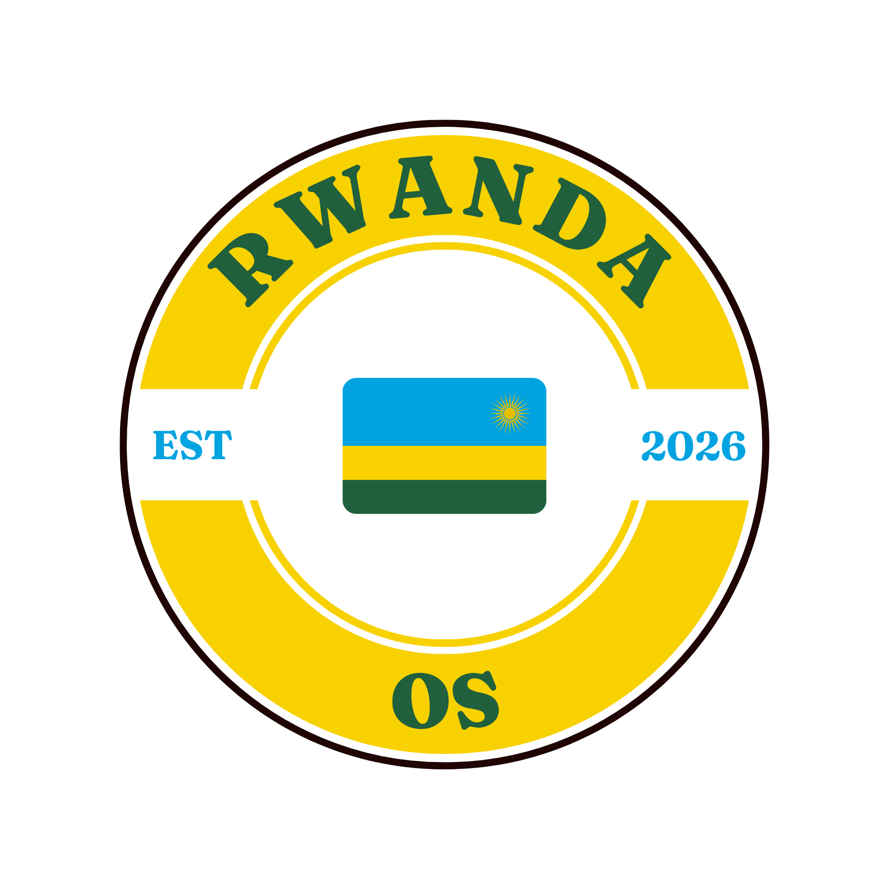
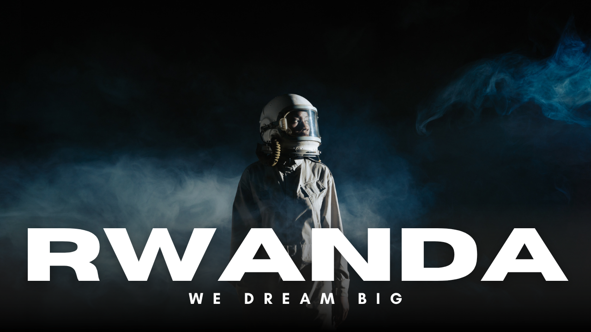

# RwandaOS

A customized Debian-based Linux distribution for students, with a Rwandan
identity: official flag colors, RwandaOS logo, custom boot splash, and the
Google Sans UI font.

| Component | Version |
| :--- | :--- |
| Base OS | Debian 13 (trixie) |
| Desktop | GNOME 48 |
| Architecture | x86_64 (amd64) |
| Image type | live ISO (`iso-hybrid`) |

<p align="center">
  
</p>

<p align="center">
  
  
</p>

---

## Branded / Configured

| Area | Detail |
| :--- | :--- |
| Boot splash (live system) | Custom Plymouth `rwandaos` script theme (logo + progress bar) |
| Live boot menu (ISO) | isolinux `splash.png` (640×480) + GRUB `splash.png` (800×600), title "RwandaOS" |
| Login (GDM) | Rwandan wallpaper, logo, "RwandaOS" banner, dark color scheme |
| Desktop theme | Dark mode by default, Google Sans UI font, RwandaOS icon theme (Adwaita-inherit) |
| Accent color | Rwanda Blue `#00A1DE` (gsettings override + GTK4 override in `/etc/skel`) |
| Wallpapers | Selectable in Settings: *RwandaOS Dream* (light) / *RwandaOS Wildlife* (dark) |
| OS identity | `/usr/lib/os-release` set to RwandaOS, `/etc/issue`, hostname `rwandaos` |
| Live session | live-config user `rwanda`, hostname `rwandaos`, autologin |
| ISO metadata | `LB_ISO_APPLICATION=RwandaOS`, volume `RwandaOS`, label `RWANDAO` |

---

## Quick Start

**Build host:** Debian 13 (trixie), x86_64. Do **not** build on Kali.

```bash
sudo ./scripts/setup-build-host.sh   # installs live-build, debootstrap, etc.
./scripts/build-iso.sh               # cleans, configures, builds the ISO
```

Output: `iso-build/rwandaos-amd64.hybrid.iso`

> `lb clean` wipes the `.build/` stage markers. `scripts/build-iso.sh`
> recreates `.build/config` after cleaning so a hand-written `config/`
> tree works with `lb build`. If you build manually, run
> `sudo mkdir -p .build && sudo touch .build/config` before `sudo lb build`.

---

## Repository Layout

```
rwandaos/
├── README.md
├── branding/
│   ├── colors.md          # official Rwanda palette (hex values)
│   ├── logo/RwandaOS.png  # 2000×2000 source logo
│   ├── wallpapers/        # dream.png, wildlife.png
│   └── fonts/             # Google Sans (duplicate of /fonts)
├── docs/
│   └── desktop-design.md
├── fonts/                 # canonical Google Sans TTFs + OFL.txt
├── iso-build/
│   ├── config/
│   │   ├── common, chroot, bootstrap, binary, source
│   │   ├── hooks/normal/  # dconf, os-release, plymouth
│   │   ├── includes.chroot_after_packages/   # themes, dconf, gdm, plymouth…
│   │   ├── includes.chroot_before_packages/  # etc/hostname
│   │   ├── bootloaders/   # isolinux + grub-pc splash + theme
│   │   └── package-lists/ # live.list.chroot, rwandaos*.list.chroot
├── packages/
│   └── rwandaos-identity/ # future .deb source (gschema override)
└── scripts/
    ├── setup-build-host.sh
    ├── build-iso.sh
    └── generate-assets.sh # regenerate icons/splash/plymouth images
```

---

## Asset Regeneration

Re-render the derived assets (icons, boot splashes, Plymouth images) from
`branding/logo/RwandaOS.png`:

```bash
./scripts/generate-assets.sh
```

Requires Pillow, ImageMagick, and rsvg-convert.

---

## Open Source

RwandaOS is released under the **GNU GPL v3** (see `LICENSE`).

- Contributing: `CONTRIBUTING.md`
- Code of Conduct: `CODE_OF_CONDUCT.md`
- Security policy: `SECURITY.md`
- Changelog: `CHANGELOG.md`
- Asset licensing: `branding/LICENSE.md` (fonts: see `fonts/OFL.txt`)

We welcome issues, PRs, and reproductions. To get started, fork the repo,
follow the build steps in [Quick Start](#quick-start), and open a pull request
with a clear description and reproduction steps.

---

## Known Limitations

- **Sounds are skipped** for now (stock PipeWire/PulseAudio).
- Google Sans ships the UI; DejaVu remains as the fallback/system font.
- The `rwandaos-identity` Debian package is **not yet wired into the ISO
  build**. The same gschema override is duplicated into
  `config/includes.chroot_after_packages/usr/share/glib-2.0/schemas/`
  so `dconf update` + `glib-compile-schemas` pick it up during `lb build`.
- The GTK4 accent override lives in `/etc/skel/.config/gtk-4.0/gtk.css`;
  libadwaita apps pick it up in the live session.
- GTK3 apps (`gnome-terminal`) use a minimal theme at
  `usr/share/themes/RwandaOS/gtk-3.0/`; accents are not re-themed there.

---

## Project Background (original meeting report)

<details>
<summary>Expand original planning notes</summary>

1. **Project Overview**

   RwandaOS is a proposed customized Linux distribution designed around the needs of students. The team agreed to use Debian as the underlying operating system and GNOME as the initial desktop environment. The project combines the stability and flexibility of Debian with a distinct Rwandan identity: custom branding, colors, sounds, wallpapers, animations, and student-focused software.

2. **Initial Project Vision**

   - **Base OS:** Debian
   - **Desktop:** GNOME
   - **Target audience:** Students
   - **Identity:** Modern, lightweight, accessible, Rwandan-inspired
   - **Visual identity:** Rwandan colors, logo, wallpapers, icons, animations
   - **Audio identity:** Custom sounds inspired by Rwanda
   - **UX:** Clean desktop with useful tools prepared for students
   - **Technical direction:** Customize and package existing open-source components rather than writing a kernel from scratch

3. **Proposed Student-Focused Features**

   - Document/PDF reading application
   - Web browser
   - Power and battery management tools
   - Advanced calculator
   - Other academic and productivity applications identified during research

   The final software list is decided after research confirms appropriate, open-source, stable, Debian-compatible applications.

4. **Technical Direction**

   RwandaOS is built as a customized Debian-based distribution. The first implementation focuses on a reproducible Debian + GNOME environment before extensive customization.

   Proposed architecture (top → bottom):

   1. RwandaOS identity and customization
   2. RwandaOS applications and configuration
   3. GNOME desktop environment
   4. Debian packages and system components
   5. Linux kernel

5. **Technical Roadmap**

   | Phase | Tasks |
   | :--- | :--- |
   | **Development Environment** | VM, install Debian+GNOME, learn filesystem, terminal, Bash, Git |
   | **Base System Research** | Debian architecture, packaging, GNOME config, live ISO, build tools |
   | **First Technical Prototype** | Clean Debian+GNOME snapshot, verify network/audio/display/storage, document changes |
   | **RwandaOS Identity** | Finalize logo, palette, wallpapers, icons, animations, GNOME/GTK theme |
   | **Sound Identity** | Define sound identity, source/create assets, integrate sounds |
   | **Student Software** | Research apps, check Debian compatibility/licensing, set defaults |
   | **Automation and Packaging** | Install/config scripts, package themes/icons/apps, reproducible builds |
   | **ISO Development** | First RwandaOS ISO, branding + software, VM testing, versioned builds (0.1) |
   | **Testing and Improvement** | Multiple VM configs, older hardware, network/audio/graphics/USB/app/update tests, bug log |

6. **Immediate Team Tasks**

   Every member prepares before the next meeting:

   - **Git Repository:** Set up central repo, folder structure, README, contribution rules, branching.
   - **Debian Resources:** Find official Debian source & live-image resources; record purpose of each.
   - **Logo and Animation:** Initial concepts for logo, visual identity, boot/login animations.
   - **Technical Roadmap Research:** End-to-end process: clean install → customization → packaging → ISO → testing.
   - **Linux Terminal and Bash:** Practice navigation, file ops, permissions, package management, scripting.
   - **Debian Filesystem:** Understand `/`, `/home`, `/etc`, `/usr`, `/var`, `/opt`, `/tmp`, `/boot`, `/dev`.
   - **GNOME Customization:** Themes, panels, menus, icons, wallpapers, window decorations.
   - **Student Applications:** Short list with reason, licensing, availability.

7. **Team Learning Requirements**

   Before technical implementation begins, each member should be able to:

   - Open and navigate a Linux terminal
   - Create, copy, move, rename, delete files/directories
   - Use absolute and relative paths
   - Use basic Bash commands and options
   - Understand file ownership and permissions
   - Install, remove, update Debian packages
   - Understand the basic Debian filesystem
   - Use Git to clone, commit, pull, push
   - Explain Debian / GNOME / kernel relationship
   - Follow the documented build and testing process

8. **Suggested Git Repository Structure**

   ```
   rwandaos/
   ├── README.md
   ├── docs/
   │   ├── architecture/
   │   ├── technical-roadmap/
   │   └── research/
   ├── branding/
   │   ├── logo/
   │   ├── wallpapers/
   │   ├── icons/
   │   └── animations/
   ├── sounds/
   ├── themes/
   │   └── gnome/
   ├── packages/
   ├── scripts/
   ├── applications/
   ├── iso/
   └── tests/
   ```

9. **Expected Outcome of the Next Meeting**

   A shared Git repository, required Debian resources, initial branding concepts, and enough technical research to begin implementation. The meeting moves into practical work: development environment, clean baseline, repository structure, first customization.

10. **Team Working Principle**

    Develop incrementally. Avoid changing many components at once. Document, test, and commit every major change. Identifying problems, returning to working versions, and reproducing the build must be easy.

11. **Conclusion**

    RwandaOS's initial direction is set: a Debian-based Linux distribution using GNOME, designed primarily for students, distinguished by a Rwandan-inspired visual and audio identity. Immediate priority is preparation. Every member needs basic confidence with core Linux tools and the build process before implementation.

</details>
